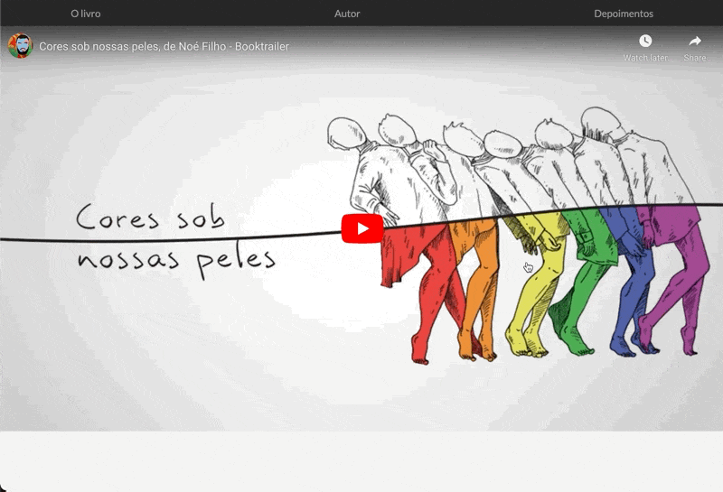

# Landing Page Book

Landing page for advertising and sales of books to independent authors



- [Cores Sob Nossas Peles](https://coressobnossaspeles.com/)

## Table of Contents

- [Features](#features)
- [Requirements](#requirements)
- [Usage](#usage)

## 🎯 Features

- No framework
- Separated development and production webpack settings you can understand
- SASS
- ES6
- Asset loading
- CSS Vendor prefixing
- Development server
- Sourcemaps
- Favicons generation
- Production optimizations
- Mobile browser header color
- Integrate with Google Analytics

## Requirements

- [Node](https://nodejs.org) > 10.3

## ⚙️ Usage

Install npm dependencies

```sh
 npm install 
```

Run the kickstart command

```sh
npm run kickstart
```

**After the project has been kickstarted**

To start the development server

```sh
npm start
```

To build for production

```sh
npm run build
```

To preview the production build

```sh
npm run preview
```

## 📚 Reference

- Webpack Starter Basic: https://github.com/lifenautjoe/webpack-starter-basic
- Dev Icons: https://github.com/devicons/devicon
- React Icons: https://react-icons.github.io/react-icons/icons?name=ri
- https://twitter.com/gontijodesign/status/1394624373823348737
- https://dev.to/swyx/how-to-add-prettier-and-eslint-automation-to-a-react-codebase-2gk1
- https://dev.to/actitime/how-to-build-a-great-developer-portfolio-examples-tools-bkj

## 👍 Contribute

If you want to say thank you and/or support the active development this project:

1. Add a [GitHub Star](https://github.com/candidosales/landing-page-book/stargazers) to the project.
2. Tweet about the project [on your Twitter](https://twitter.com/intent/tweet?url=https%3A%2F%2Fgithub.com%2Fcandidosales%2Flanding-page-book&text=Dependencies%20report%20aims%20to%20help%20analyze%20the%20consistency%20of%20the%20dependencies%20in%20your%20company%27s%20frontend%20projects).
3. Write a review or tutorial on [Medium](https://medium.com/), [Dev.to](https://dev.to/) or personal blog.
4. Support the project by donating a [cup of coffee](https://buymeacoff.ee/candidosales).

## ☕ Supporters

If you want to support Landing Page Book, you can ☕ [**buy a coffee here**](https://buymeacoff.ee/candidosales)

## ✨ Acknowledgment

- [Joel Hernandez](www.lifenautjoe.com)

## Author

- Cândido Sales - [@candidosales](https://twitter.com/candidosales)

## ⚠️ Copyright and license

Code and documentation copyright 2020-2030 the [Authors](https://github.com/candidosales/landing-page-book/graphs/contributors) and Code released under the [MIT License](https://github.com/candidosales/landing-page-book/blob/master/LICENSE). Docs released under [Creative Commons](https://creativecommons.org/licenses/by/3.0/).
